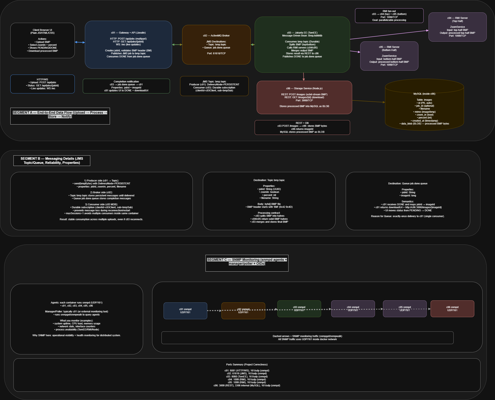

# Distributed BMP Processing System (DAD)

This project implements a **distributed system for BMP image processing**, developed for the **Distributed Applications Design (DAD)** course.  
The architecture is based on microservices, asynchronous messaging, and parallel processing.

---

## Architecture Overview

The system is composed of multiple Docker containers that collaborate to process BMP images asynchronously:

- **Client / API Gateway (c01)**  
  Receives BMP uploads and starts the processing workflow.

- **ActiveMQ Broker (c02)**  
  Handles JMS communication:

  - Topic for job distribution
  - Queue for job completion notifications

- **Processing Service (c03 – Jakarta EE, TomEE)**  
  Uses a Message-Driven Bean (MDB) to consume jobs, coordinate processing, and aggregate results.

- **RMI Servers (c04, c05)**  
  Perform parallel BMP processing (top half / bottom half).

- **Storage Service (c06 – REST + MySQL)**  
  Stores processed images in the database and exposes download endpoints.

- **SNMP (all containers)**  
  Provides operational monitoring.

---

## Architecture Diagram



---

## Processing Flow (Summary)

1. User uploads a BMP image.
2. Gateway publishes a JMS message to a Topic.
3. Processing MDB consumes the message.
4. Image is split and processed in parallel via RMI.
5. The result is merged and stored in MySQL.
6. A completion message is sent via JMS Queue.
7. User downloads the processed image.

---

## Technologies Used

- Java 17
- Jakarta EE (TomEE, MDB)
- JMS (ActiveMQ)
- RMI
- REST (Node.js)
- MySQL
- Docker & Docker Compose
- SNMP

---

## How to Run the Application

### Requirements

- Docker
- Docker Compose

### Run Steps

From the project root directory:

```bash
docker compose down
docker compose build --no-cache
docker compose up -d
```

To view logs:

```bash
docker compose logs -f
```

To run the front-end web app:

```bash
cd frontend
npm install
npm run dev
```
